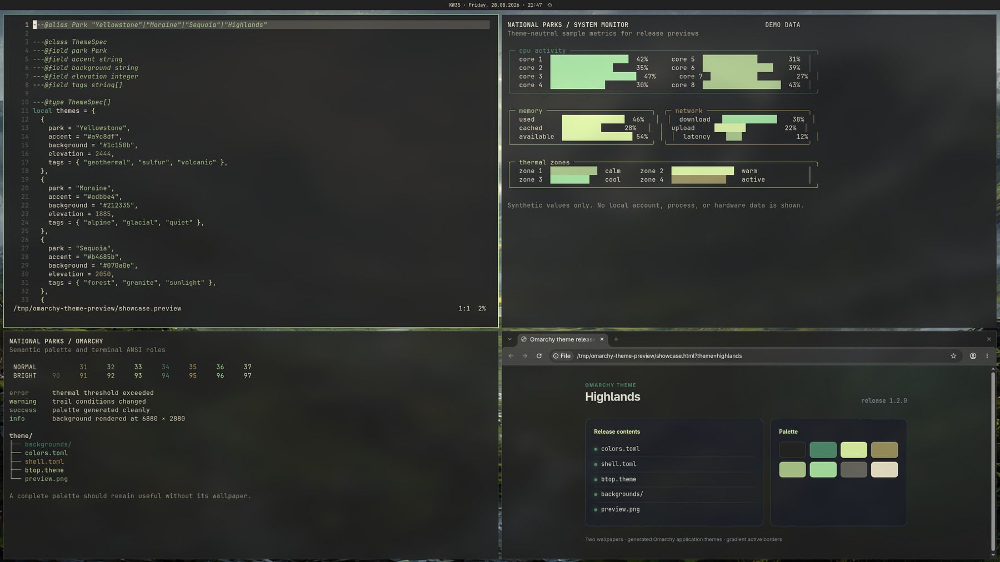
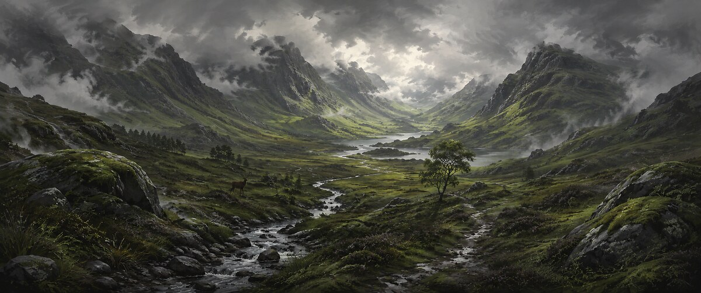
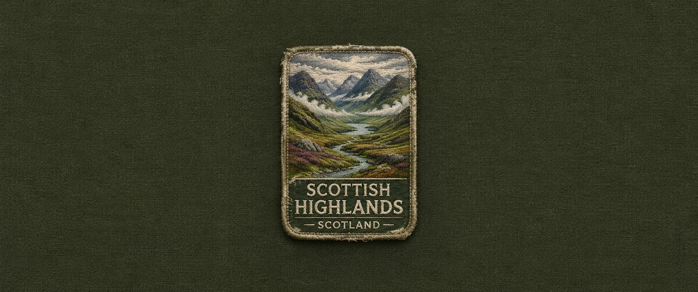

# Highlands for Omarchy

A dark Omarchy theme built around charcoal crags, Scots pine, wet stone, pale mist, and lichen light. Its palette was generated from the original illustrated Scottish Highlands wallpaper with Aether and kept intact. The illustrated wallpaper is the default; the embroidered patch is the alternate.



## Wallpapers

### Illustrated (default)



### Embroidered patch alternate



## Install

```bash
omarchy theme install https://github.com/nibra180/omarchy-highlands-theme
```

Reapply it later with:

```bash
omarchy theme set highlands
```

## Neovim syntax mapping

`neovim.lua` keeps the Highlands palette intact but gives code a clearer hierarchy: warm keywords, pine functions, lichen types, moss strings, cyan members, plain variables, and more readable comments.

Omarchy deliberately strips Lua from Git-installed themes and generates a safe replacement from `colors.toml`. The normal install command still works, but it uses Aether's default syntax assignments. To opt into the repository's custom mapping, make a local copy without Git metadata:

```bash
cp -a ~/.config/omarchy/themes/highlands ~/.config/omarchy/themes/highlands-local
rm -rf ~/.config/omarchy/themes/highlands-local/.git
omarchy theme set highlands-local
```

## Included

- `colors.toml` defines complete Omarchy semantic and ANSI color roles.
- `neovim.lua` contains the custom Aether palette and syntax assignments.
- `shell.toml` uses pine-to-lichen borders over charcoal and peat surfaces.
- `btop.theme`, `chromium.theme`, and `icons.theme` cover app-specific details.
- `backgrounds/` contains two 6880x2880 wallpapers; the illustrated version is the default.
- `preview.png` is the 1800x1012 gallery preview.
- `DESIGN.md` records the palette and visual rules.

Omarchy generates Hyprland, terminal, Neovim, Helix, Pi, Obsidian, keyboard, and VS Code files from `colors.toml`. For Git-installed copies, it replaces the repository's `neovim.lua` with its generated configuration while retaining the same palette.

## Artwork and affiliation

The wallpapers and preview were created by nibra180. The Highlands name identifies the Scottish region that inspired the theme; this project is independent and does not imply endorsement by any tourism or government body. See [ASSETS.md](ASSETS.md) for attribution details.

## License

Theme configuration and documentation are licensed under the [MIT License](LICENSE). The wallpapers and preview are licensed under [CC BY 4.0](LICENSES/CC-BY-4.0.txt).
